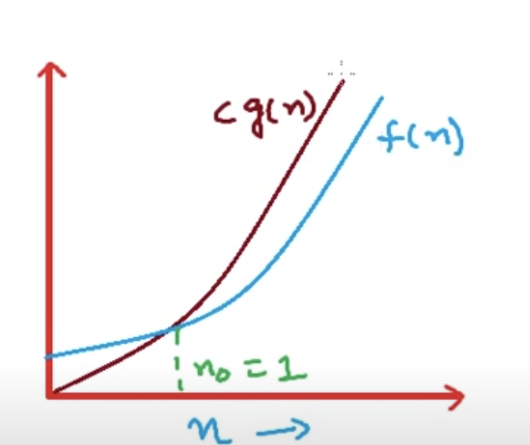

# Asymptotic Notation  - BIG O

Classify Running time in broad classes

algo1:   T(n) = 5ne + 7          // Model Machine

Algo2:   T(n) = 17n2 + 6n + 8      // 6n + 8 quadratic 17n2 exponential

  1) n --> OO
  2) no of Constantants


## Big O  notation   - Upper Bound of rate of Growth

0 g(n) = { fn : there exist
               constants c and No
               f(n) ≤  cg(n) for  n ≥ no
               }

|  a function 	|  f(n) = 5n^2 + 2n + 1  	|   	|  O( n^2 ) 	|   	
|---	|---	|---	|---	|
|   	|  g(n) = n2   	|   	|   	|   	|
|   	|   ```   c = 8    ```| f(n) ≤ 8n^2 for  n ≥ 1   	|   	|   	
|   |f(n) =  5n^2 + 2n + 1 is a member of the set:	|   	| ```no = 1     O(n^2)```  	|   	|   	

|  |  |   |
|---|---|---|
|   |  |     |                 
|   | |


## Omega Ωnotation - Lower Bownd of rate of growth

Ω(g(n)) { f(n): there exist
     constants c and no ,
     cg(n') ≤ f(n) for n≥ no

}

f(n) = 5n^2 + 2n + 1 = º()
 g(n) = n^
 c=5
 no = 0    5n^2 f(n), n>0

## øTheta Notation
Gives teh best idea of rate of growth it gives a tight bound

ø(g(n))= { f(n): there exist
          constants c1/c2 and no,
          c1 g(n ≤ f(n) ≤c2(g(n))),
          for n ≥ no

}

f(n) = 5n^2 + 2n + 1 = ø(n^2)
g(n) = n^2
c1 = 5, c2 = 8 n0=1
