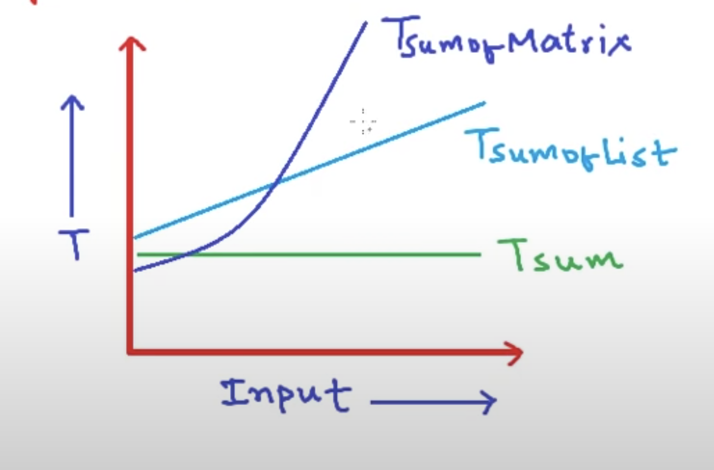

Example Fuction

Constant Time Algorythm
Program                     Tsum = 2

Sum(a,b)                                   
{
    return a+b  
}
                                Cost            no. of times        

Sum of  LIst (A,n)                  
{
    total = 0                      1                    1
    for i=0 t n-1                  2                    n+1
        total = total + Ai         2                    n 
    
    return total                   1                    1
}

  TsumofList = 1 + 2(n+1) +2n + 1 
             = 2 + 2n +2n + 2
             = 4 + 4n
             = 4(1 + n)

T(n) = Cn + C'                 
   where C = Csub2 + C sub3
   C' = Csub1 Csub2 + Csub4

Tsum = K                            On (set of all functions of this form)
Tsumoflist = Cn + c'                On
TxumofMatrix = an^2 + bn + c        O(n^2)

Rate of growth of quadratic function much higher

